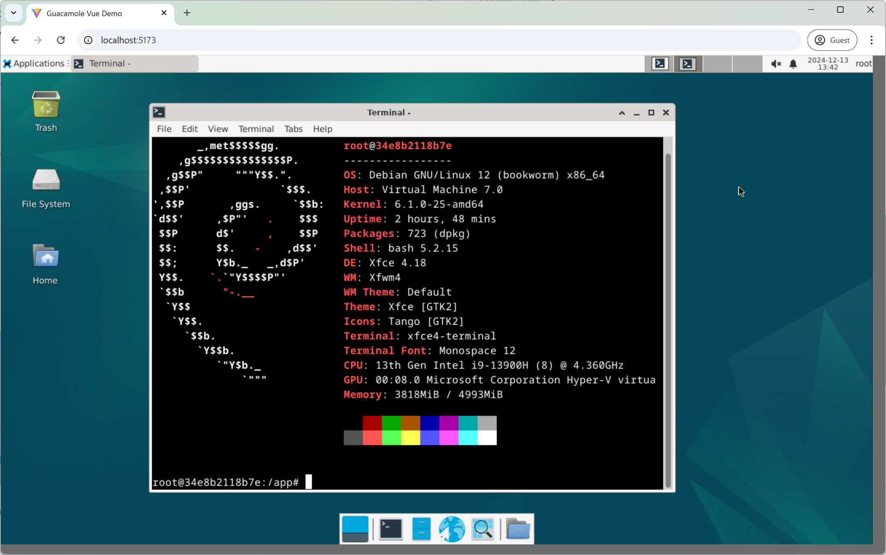
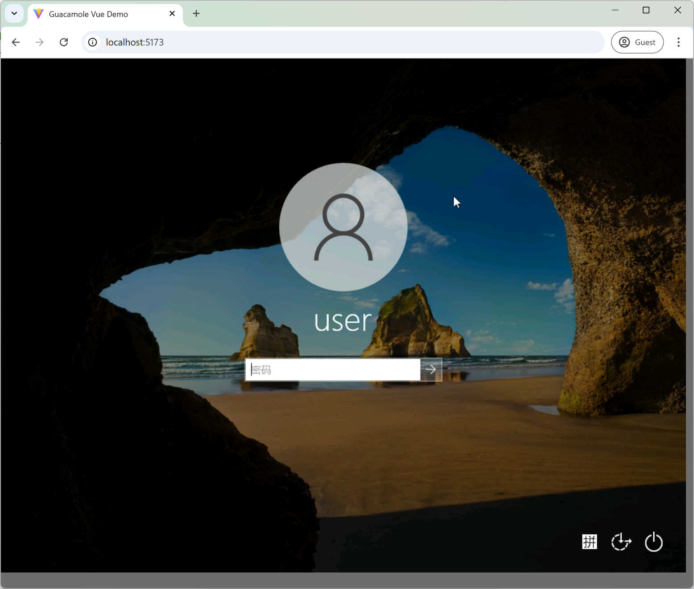

# Guacamole Node.js + Vue 3 + TS Demo

VNC:


RDP:


## Based on Libraries

- [guacamole-lite](https://github.com/vadimpronin/guacamole-lite)
- [guacamole-common-js](https://github.com/padarom/guacamole-common-js)


## How to Run Demo

### Server

First of all, run guacd service via docker ([reference](https://guacamole.apache.org/doc/gug/guacamole-docker.html)):
```shell
docker run --name guacd -p 4822:4822 --network host -d guacamole/guacd
```

Config host ip address if needed:
```js
const guacServer = new GuacamoleLite({
  // WebSocket server port
  port: 8080,
}, {
  // Config host ip address if needed, default is localhost.
  host: '10.0.0.12',
  // guacd server port
  port: 4822,
...
```

Start server
```shell
yarn install
node server.js
```

### Client

Start client
```shell
cd client
yarn install
yarn dev
```

Edit connect settings in `client/src/components/DemoFull.vue`

```js
  const token = await encryptToken({
  // connection: {
  //   type: "rdp",
  //   settings: {
  //     "hostname": "10.0.0.12",
  //     "username": "user",
  //     "password": "Test.Password",
  //     "enable-drive": true,
  //     "create-drive-path": true,
  //     "security": "any",
  //     "ignore-cert": true,
  //     "enable-wallpaper": true
  //   }
  // }

  connection: {
    type: "vnc",
    settings: {
      hostname: '10.0.0.12',
      port: '5901',
      password: 'Test.Password',
      "ignore-cert": true,
      "resize-method": "display-update"
    },
  }
}, 'MySuperSecretKeyForParamsToken12')
```

Tips: Token generation example code can be found in `client/public/token.html`